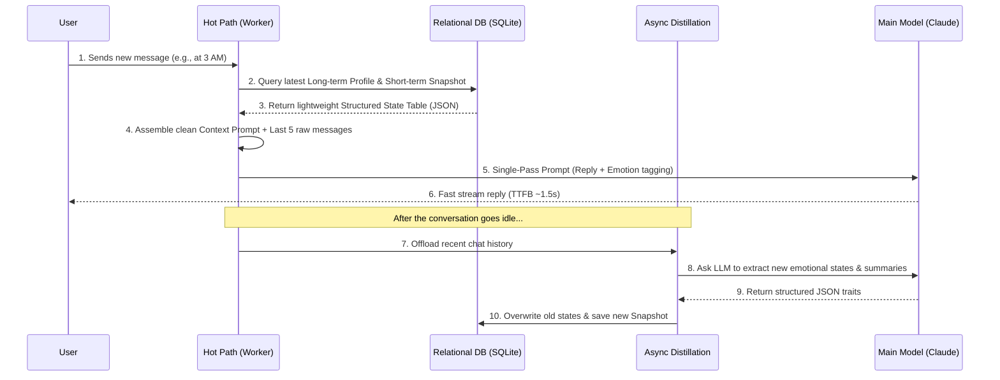

# 🚀 Structured RAG Memory System (SQLite-based) - Architecture Overview

This is a lightweight Retrieval-Augmented Generation (RAG) architecture specifically optimized for **long-timeline role-playing (RP) and high-frequency emotional companionship**.

Unlike traditional Vector DB-based RAG—which simply retrieves raw text chunks and inevitably suffers from "temporal hallucinations" (confusing past events with current intentions)—this system uses a dual-engine approach: **Asynchronous LLM Feature Distillation + SQLite Relational Retrieval**. 

## 🎯 Core Architectural Philosophy

- **Structured Memory Flow**: We abandon raw transcript retrieval on the hot path. Instead, the system uses background LLM workers to periodically distill unstructured conversations into strict JSON formats: `Plot Summaries`, `Key Events`, and `Character Profiles` (emotional states).
- **Precision Context Assembly**: Old emotional states are actively overwritten by new ones in the relational database. During a live chat, the system injects a highly compressed, non-contradicting state table directly into the prompt. This eliminates the "bloated context" problem and drops latency to a minimum.

---

## 📂 Core Component Mapping

### 1. Storage & Schema Design (The State Tables)
Instead of a giant vector index, we design structured relational tables optimized for LLM context injection.
- **File**: `database.py`
- **Core Logic**:
  - `memory_snapshots` table: Stores highly compressed "short-term memory snapshots" distilled by the LLM.
  - `memory_profiles` table: Stores long-term "static character profiles" and evolving emotional baselines.
  - `continuous_analysis` table: Continuously tracks conversational progression to trigger proactive agent behaviors (e.g., initiating an active voice call).

### 2. Data Ingestion & Feature Distillation (Background Workers)
We do not just "stuff raw text into a DB." We preprocess data to extract intelligence.
- **File**: `services/memory_service.py`
- **Target Function**: `process_conversation()`
- **How it works**: This is the **cognitive engine**. Operating asynchronously, it analyzes the recent `N` chat logs using an LLM API to extract structured `plot_summary` and `character_profiles` (e.g., current mood). These extracted traits are saved as new snapshots in the database, overwriting outdated emotional states.

### 3. Context Retrieval & Assembly (The Hot Path)
This is where the RAG payload is assembled for the main model, optimized for ultra-low latency.
- **File**: `services/memory_service.py`
- **Target Function**: `get_context_for_prompt()`
- **How it works**: Based on the `chat_id`, it rapidly queries SQLite for the latest character profiles and recent dynamic snapshots. It serializes these into a clean Markdown structure (`## Profiles`, `## Recent Plot`, `## Key Memories`), injecting it seamlessly into the next LLM System Prompt. No contradictory transcripts are included.

---

## 🔄 System Workflow

Here is how the architecture closes the loop between immediate responsiveness and long-term memory consolidation:

